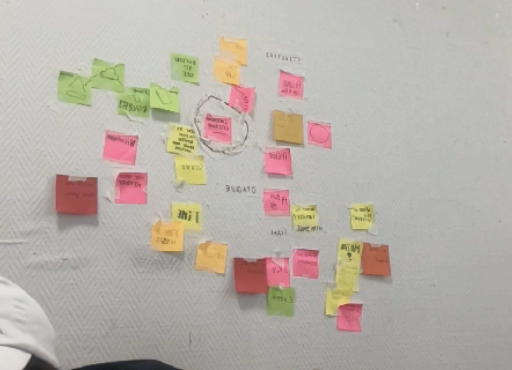

Deep painting – An experiment about photography, painting and neural networks. „Gruppenbild" (group photo) describes, in form of an analogue book, the process of a machine learning algorithm, which is started with abstract paintings as a source and is continously fed with photographic portraits. The different stages of the process are displayed in 700 pages of abstract, deformed, weird portraits.

700 pages, 190 x 125cm, screenprinted cover
